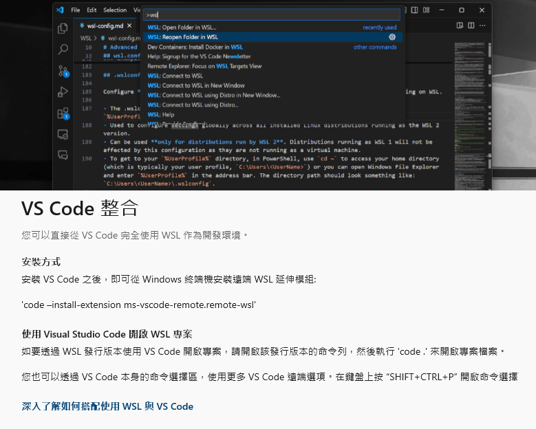

# 使用 VScode 連線到 WSL 進行開發  

1. 在 VScode 安裝套件 `WSL`  
2. 點擊VScode左下角藍色連線按鈕  
3. 選擇 "Connect to WSL using Distro"  
4. 選擇要連線到的 WSL 環境  
5. 連線成功後，左下角會顯示當前連線的環境  
6. 可從左側目錄中選擇要開啟的 folder  
7. "取消連線"，一樣點擊左下角藍色連線按鈕  
8. 選擇 "Close Remote Connection"  