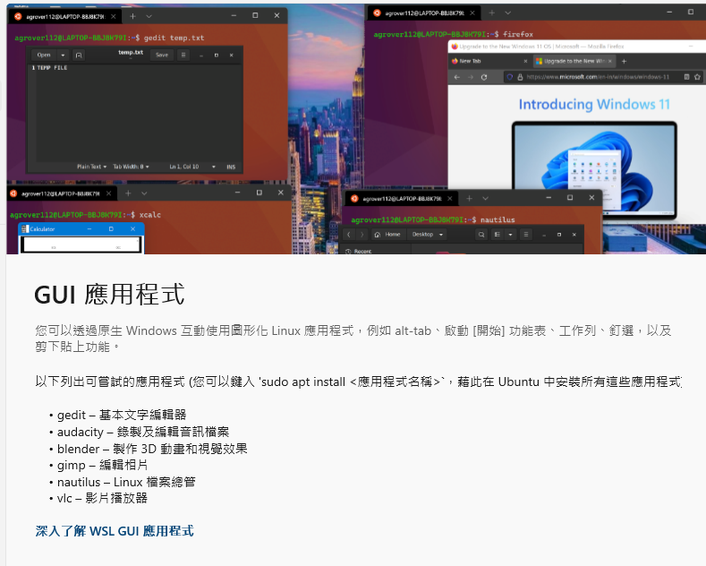

# WSL  

[https://learn.microsoft.com/zh-tw/windows/wsl/basic-commands](https://learn.microsoft.com/zh-tw/windows/wsl/basic-commands)

# Linux讀取windows

        cd /mnt/c

# 檔案總管存取Linux  

        \\wsl.localhost\

# wsl 中執行 windows 程式、檔案

        powershell.exe /c start

# 在 Windows 子系統 Linux 版上執行 Linux GUI 應用程式  

[https://learn.microsoft.com/zh-tw/windows/wsl/tutorials/gui-apps](https://learn.microsoft.com/zh-tw/windows/wsl/tutorials/gui-apps)

  

