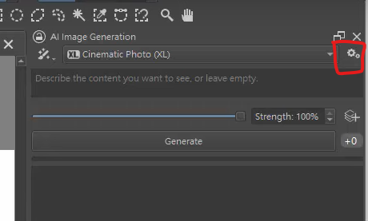
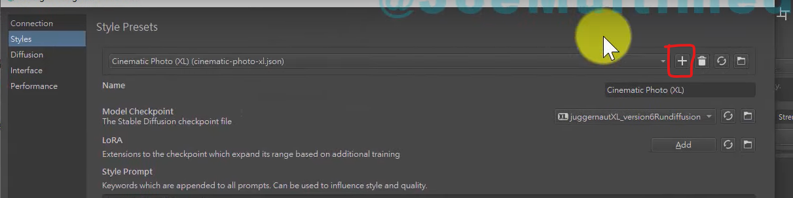
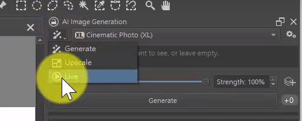
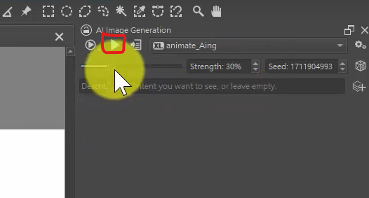
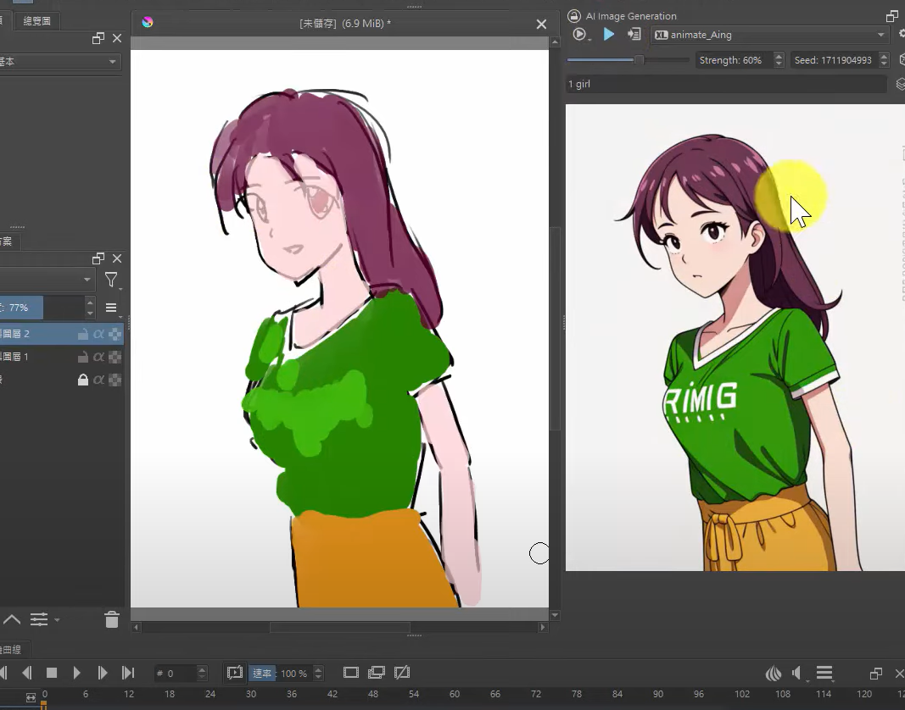
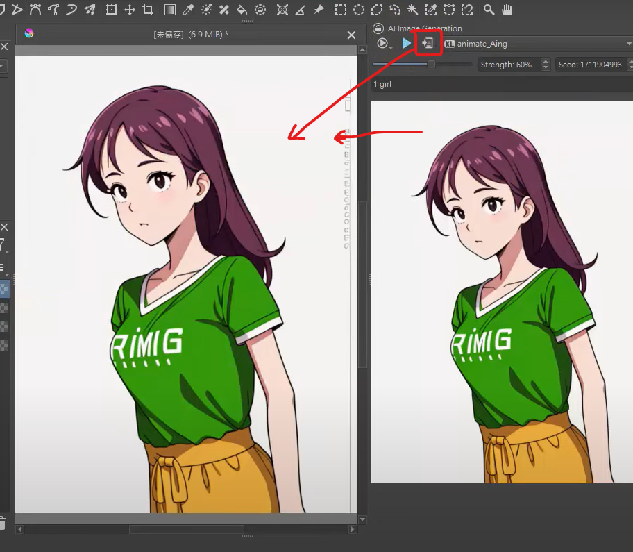
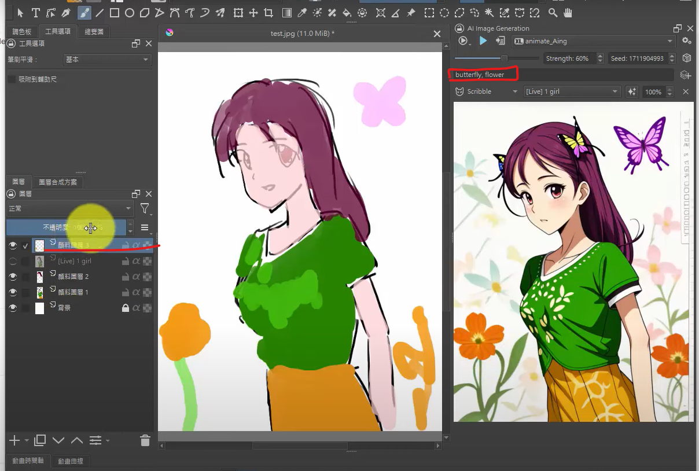

# Krita AI realtime 繪圖設定

- 1.doc

  https://github.com/Acly/krita-ai-diffusion

- 2.plugin

  https://github.com/Acly/krita-ai-diffusion/releases/latest

- 3.放在

  C:\Users\<user>\AppData\Roaming\krita\pykrita

  解壓縮：會有兩個物件

        ai_diffusion
        ai_diffusion.desktop

- 4.打開 krita
  設定/設定krita/python外掛程式管理器  

- 5.選擇 AI Image Diffusion  

  右邊選單出現 `AI Image Deffusion` 打勾後，按`確定`  

- 6.檔案/建立/自訂檔案(可以不做，之後會重啟)  
  `新建檔案`  

- 7.設定/工具面板/AI Image Generation  
  開啟AI面板  

- 8.Configure(在AI image generation面板中點擊)  

  `server management`中選擇`local server`，先不設定 server path: 找大容量的硬碟  

- 9.改變 krita 資源目錄

  複製 `c:/users/[username]/appData/Roaming/krita`

  到容量較大的硬碟目錄 `D:\Git\krita_ai_local_server`，將`appData/Roaming/krita`複製過來  

  `設定/設定krita/資源`，改成新的資料夾`D:\Git\krita_ai_local_server\krita`

  關閉krita

- 10.

  - 檔案/建立/自訂檔案
  - 設定/工具面板/AI Image Generation
  - Configure，選擇`local server`修改為:  
    `D:\Git\krita_ai_local_server\krita\pykrita\ai_diffusion\server`

- 11.選擇跑在cpu或是gpu  
  - 下方模型全部勾選
  - 點擊`install`會開始下載模型  

- 12.開始使用，在`AI Image Generation`

  選擇模型

  輸入 prompt

  按下產生

- 13.使用自訂模型

  - 下載模型，到`civitai.com`
  - ex. http://civital.com/models/34553/aingdiffusion
  - click download  
  - 放入 `krita/pykrita/ai_diffusion/.server/ComfyUI/models/checkpoints`

- 14.realtime 依據畫面畫上的圖，AI同時生成。  

  - 設定`自訂 Style`如圖，按下  
    

  - 按下 +  
    

  - 輸入 sylte 名稱

  - 選擇 checkpoint，選擇剛才下載的。  

  - 輸入 style prompt(正向提示詞)，可參考civit.ai裡其他人的    
    best quality, highres

  - 輸入 negative prompt(反向提示詞)，可參考civit.ai裡其他人的

  - 按 OK  

  - 回到畫布  
  
  - 選擇 live mode  
      

  - 選擇剛建立的 style  

  - strength 越大 ai 繪圖越大  

  - 點 開始三角形  
      

  - 開始畫圖  
      

  - 覺得可以就停止剛才的執行  

  - 套用  
      

  - 增加提示詞、圖層  
      

# 更新版本  

  - 下載位置一樣  
  - 記得存到 新的位置`D:\Git\krita_ai_local_server\krita\pykrita\`
  - 複製取代  
  - 重啟程式  
  - 到 `AI Image Generation`的設定，可能需要`upgrade`  

# reference  

[https://www.patreon.com/posts/krita-ai-hui-tu-94125522](https://www.patreon.com/posts/krita-ai-hui-tu-94125522)
[[AI tutorial] 免費繪圖軟體 Krita 如何用 AI 產圖及即時繪圖](https://www.youtube.com/watch?v=ttXF9HPcvRw)
[[AI tutorial] 免費繪圖軟體 Krita 的 AI 產圖擴充程式更新、使用 LoRA與即時繪製擬真圖片](https://www.youtube.com/watch?v=xVIZ6nucJxA)