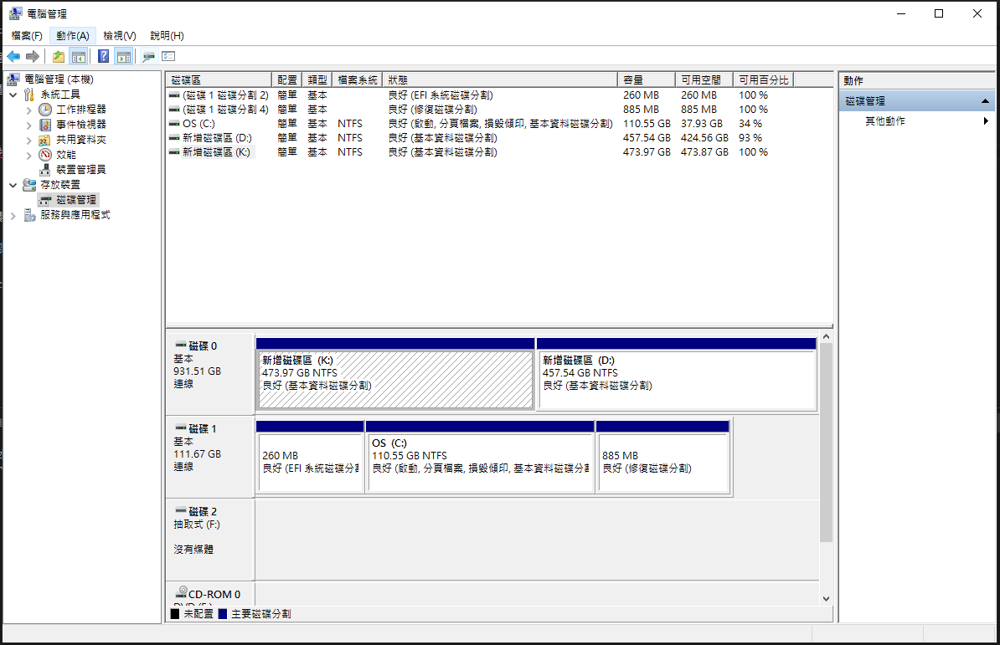

## 系統資訊  

    Win + R  

輸入 `msinfo32` 可以查看  

# Windows 10新增硬碟  

[https://blog.xuite.net/yh96301/blog/587861169-Windows+10%E6%96%B0%E5%A2%9E%E7%A1%AC%E7%A2%9F](https://blog.xuite.net/yh96301/blog/587861169-Windows+10%E6%96%B0%E5%A2%9E%E7%A1%AC%E7%A2%9F)

搜尋 > 電腦管理 > 磁碟管理  

※可在下方分割區內按右鍵看"內容"  

## 新增磁碟區  

在"未配置"區域按右鍵選"新增簡單磁碟區"，按照畫面指示按"下一步"即可  

## 刪除磁碟區  

分割區內按右鍵選"刪除磁碟區"  

## 如何分辨硬碟的分割表是MBR還是GPT  

[https://blog.xuite.net/yh96301/blog/585117486](https://blog.xuite.net/yh96301/blog/585117486)  